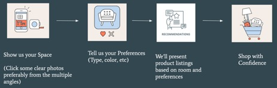
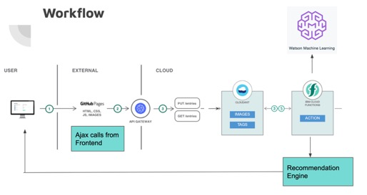

# CS594 - Innovation and Entrepreneurship Project - Design.IT

__Project Name:__ Design.IT

__Group Name:__ “That Fourth Group”

__Group Members:__
1.	Abdullah Aleem (UIN: 650991946)
2.	Manoj Prabhakar Nallabothula (UIN: 662749754)
3.	Saikrishna Vanamala (UIN: 677643742)
4.	Varsha Jayaraman (UIN: 662139286)

__Website:__ https://design-it-cs594.github.io/cs594-designit/

__GitHub Repo:__ https://github.com/design-it-cs594/cs594-designit

### Description: 

Our Project is to build an AI system that helps you to choose optimal furniture for your home or workplace. Depending upon the user’s preference and Room Aesthetics, we have developed a system to understand the room features, user’s preference and provide intelligent suggestions to buy furniture online.

How it Works:
	

1.	User uploads image and tells his/her preferences.
2.	We understand the image and consider the preferences and give intelligent suggestions.

### Architecture:

1.	The User will Upload the Image on the Website Hosted in GitHub Pages.
2.	The Uploaded image will be stored in IBM Cloudant via a REST API Call.
3.	The storage of the image will trigger an action and will invoke the IBM Watson Machine Learning service in which the CV model has been deployed.
4.	The CV model will analyze the image and send the Statistics back to Backend.
5.	The Backend will send the Stats to Frontend to ask the User his/her preferences.
6.	The Backend will get User Preferences based on Image statistics.
7.	These preferences will be given to a Suggestions action which will list all the furniture which match the statistics and User Preferences.
8.	The Backend will send the Final output to UI. 

### Major Modules Involved: 

1.	Serverless Backend using IBM Cloud

2.	Computer Vision: Object detection and Dimension Estimation

3.	Web Scrapping, Collections and Database Design

4.	Frontend UI

#### 1.	Module: Serverless Backend and Integration
Techniques Used: IBM Serverless – Actions and Sequences
Infrastructure: IBM Cloud
GitHub Folder: https://github.com/design-it-cs594/cs594-designit/tree/master/IBM
Walkthrough:
The Backend will connect all modules via REST API calls using IBM Cloud Functions.

#### 2.	Module: Machine Learning/Object Detection
Libraries Used: Tensorflow, watson_machine_learning_client, numpy, requests

Techniques Used: Convolutional Neural Net 

Infrastructure: IBM Watson

GitHubFolder: https://github.com/design-it-cs594/cs594-designit/tree/master/ML 

Code Walkthrough:
1.	The model for object detection that we have implemented is deep lab net which a state-of-the-art image segmentation model developed by google. You can find the code for model in the ML folder. The Jupyter notebook contains details on how to deploy the model. The model has been made using TensorFlow version 1.14 and IBM Watson python client is used to deploy the model. This model was trained on ade20k data and only the relevant classes were detected. Some classes were also merged for example different types of floors e.g. carpet or hardwood were considered together only floor. The primary reason for choosing this model was to detect both objects and floor and wall. The model tells us what objects are present in the image and the location in the image. We can use this information to find out the information about the objects e.g. color etc. The colors from the object can be extracted from the cropped object images. This technique was ideal for color extraction as we got the exact pixels and even the bounding box was generated from those pixels. The technique that was initially used to extract color was histogram technique which measures the most common color in the image after converting into HSV color space. However, we decided not to use color for the purpose of classifying for demo’s scope. This model has been deployed on IBM Watson using watson_machine_learning_client its RESTful API was exposed from the cloud console where we could simply make a post request and get the result of the image as json. This was done is IBM functions.
2.	One the user uploads the image, it is saved on the Cloudant database. The code for this can be find in upload.js where when the submit button from index.html (homepage) is pressed it posts a request to the cloudant api which stores the data. A trigger function is set in IBM Functions for whenever there is an image put in the images bucket. An action is also associated with this trigger as IBM function which reads the image that has been posted and issues a post request to the machine learning model. The results for this model are then passed to the recommendation engine.

#### 3.	Module: Frontend (UI and Rest API Calls)           
Libraries Used: HTML,CSS, Vanilla Java Script           

Techniques Used: AJAX for REST API calls

Infrastructure: Github Pages

GitHub Folder: https://github.com/design-it-cs594/cs594-designit/UI

Code Walkthrough:
1.	Index.html interacts with upload.js to make backend calls in Cloudant Database to present appropriate data on the browser.
2.	The UI, apart from the non-interactive pages, have three crucial sections: 
3.	Image Upload: The portion where the customer uploads the picture of the room he wishes to design. At the click of “Upload”, the image is added in IBM Cloudant Database, via add() method in uploadToCloudant().
4.	Once the image is uploaded, the IBM Watson Computer Vision Module uses Convolutional Neural Networks to detect classes of objects(Eg: Sofa, Table, Mattress) in the picture. These classes are stored in a “Tags” database indexed with the picture ID.
5.	A rest call is placed to Cloudant’s exposed URI to retrieve the tags(Object detection), which is shown to the user.
6.	User Preferences: The user is asked to enter preferences on a number of properties like the kind of furniture(Sofa, Mattress, Tables) that they are looking to purchase, the color that they need them in, and also the room dimensions.
7.	Furniture Recommendation: The recommendation() procedure takes the above-mentioned user inputs to read the appropriate JSON(sofa.json) which is the scraped data in JSON format, hosted on Cloudant. Matches with the user inputs are made with each object and the filtered recommendations are posted from JS to the UI.
8.	CloudantURL in upload.js is the URI for images database, while apiUrl is the URI for Tags Database.

#### 4.	Module: Web Scraper and Data Storage
Libraries Used: requests, pandas, BeautifulSoup

Infrastructure: Jupyter Notebooks

GitHub: https://github.com/design-it-cs594/cs594-designit/tree/master/WebScraper

Code Walkthrough:
1. WebCrawlerforLinks.ipynb, will generate all individual furniture weblinks from a root Furniture website

	Input: Give Furniture website’s root address for getLinks() function and depth value
	
	Output: It generates furniture weblinks
2. designit_individual_product_scrapper.ipynb, will generate final CSV files for each furniture.

	Input: Furniture Weblinks from WebCrawlerforLinks.ipynb output
	
	Output:
	Final Furniture CSV for each specific furniture. Included below columns
	'Brand', 'Price', 'Image', 'Length', 'Width', 'Height', 'Seller', 'ProductLink'
